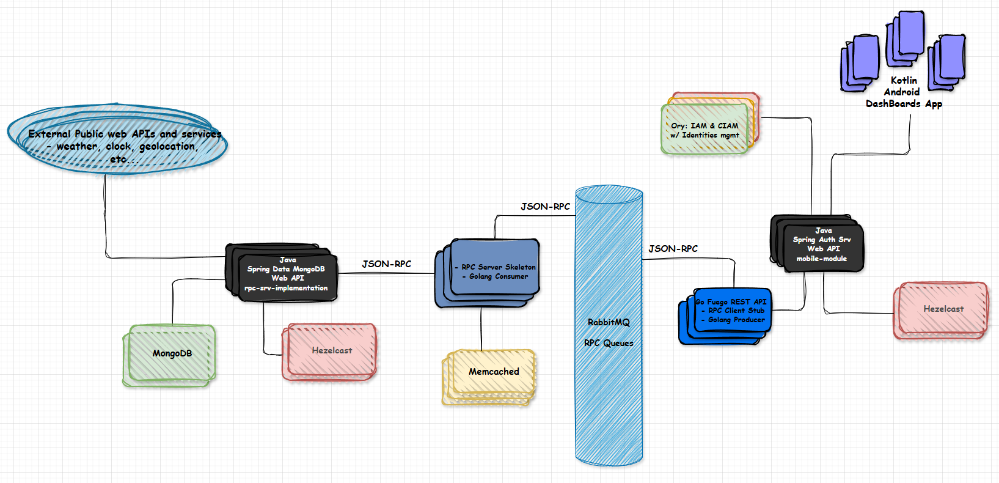

# world info dashboards

- A distributed-system for World information retrieval, processing and management (weather, clock, geolocation, local information, conversion, etc.).
>
- Java Spring web REST API and HTTP SSE server using Authorization Server leveraging Ory Hydra for OAuth 2.0 and OpenID Connect. Hazelcast for distributed caching and in-memory data grid.
>
- JSON RPC Protocol using RabbitMQ asynchronous queues for RPC communication.
>
- Golang RPC client stub (RabbitMQ publisher) + Golang fuego Public RESTful OpenAPI (RPC service simplified abstraction for users interface/integration). All namespaces/classes/instances and their members calls (JSON-RPC) are allways network calls, no local calls.
>
- Golang RPC server skeleton worker (RabbitMQ subscriber). Memcached for workers caching. Some identified classes and or selected members (JSON-RPC) are local calls using data from memcached.
>
- Java RPC server implementation using Spring Boot for Web Services, MongoDB for data persistence and Hazelcast for real-time in-memory data grid and distributed caching. Client of several external services (weather, geolocation, maps, images, etc.).
>
- Kotlin Android application for mobile devices. Dashboards creation, customization and management / Data transformation and visualization / Geolocation (multiple sources), maps, routes, local images / image of the day and similar features / Notifications and alerts (on data definitions and configurations).