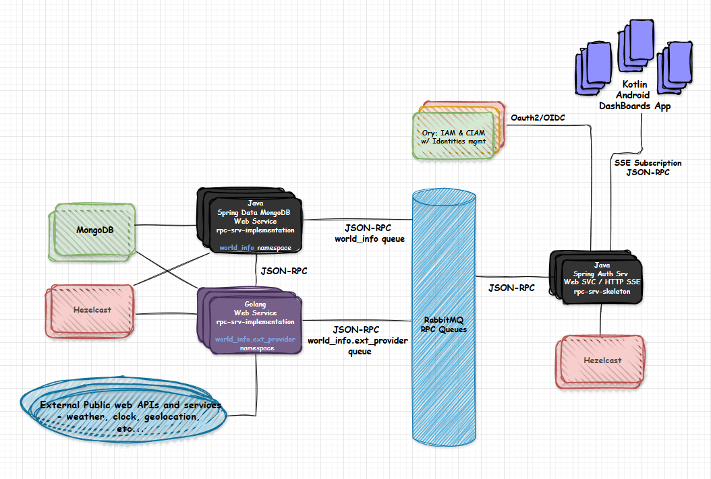

# world info dashboards

- A distributed-system for World information retrieval, processing and management (weather, clock, geolocation, local information, conversion, etc.).
>
- JSON-RPC V1 (for simplicity and ease of use) using RabbitMQ asynchronous queues for RPC communication.
>
- Java Spring web service and HTTP SSE server using Authorization Server leveraging Ory Hydra for OAuth 2.0 and OpenID Connect. Hazelcast for distributed caching and in-memory data grid. RPC server skeleton.
>
- Java RPC server implementation (world_info namespace) using Spring Boot for Web Services, MongoDB for data persistence and Hazelcast for real-time in-memory data grid and distributed caching.
>
- Golang RPC server implementation (world_info.ext_provider namespace) using MongoDB for data persistence and Hazelcast for real-time in-memory data grid and distributed caching. Client of several external services (weather, geolocation, maps, images, etc.).
>
- Kotlin Android application for mobile devices. Dashboards creation, customization and management / Data transformation and visualization / Geolocation (multiple sources), maps, routes, local images / image of the day and similar features / Notifications and alerts (on data definitions and configurations).